<div align="center">

# 🏦 Ceylon Trust Bank PLC
### Executive Banking Intelligence Dashboard

A modern **Executive Banking Intelligence Dashboard** developed using **Python**, **Dash**, **Plotly**, **Pandas**, and **SQLite**. The application enables banking executives to monitor KPIs, analyze customer and financial data, evaluate branch performance, and support data-driven decision-making through interactive visual analytics.

<br>


</div>

---

# 📌 Overview

The **Ceylon Trust Bank PLC – Executive Banking Intelligence Dashboard** is a business intelligence application designed to simulate a modern banking analytics platform.

The system transforms banking data into meaningful insights through interactive dashboards, executive KPI cards, charts, and reports. It allows users to monitor customer information, account portfolios, banking transactions, loan performance, and branch operations from a single interface.

This project demonstrates the practical application of **Business Intelligence**, **Data Visualization**, and **Python Dashboard Development** in the banking domain.

---

# ✨ Key Features

- 📊 Executive KPI Dashboard
- 👥 Customer Management & Analytics
- 💳 Account Portfolio Analysis
- 💸 Transaction Monitoring
- 🏦 Loan Portfolio Analytics
- 🏢 Branch Performance Dashboard
- 📈 Executive Reports
- 📉 Interactive Plotly Visualizations
- 🔍 Search & Filter Functionality
- 🎨 Modern Responsive User Interface
- 🗄 SQLite Database Integration
- 📱 Professional Dashboard Layout

---

# 🖥 Dashboard Modules

| Module | Description |
|---------|-------------|
| 🏠 Dashboard | Executive KPIs, business insights, interactive charts |
| 👥 Customers | Customer records and analytics |
| 💳 Accounts | Account portfolio analysis |
| 💸 Transactions | Banking transaction monitoring |
| 🏦 Loans | Loan portfolio management |
| 🏢 Branches | Branch performance comparison |
| 📈 Reports | Executive reports and summaries |
| 👤 Profile | User profile management |
| ⚙ Settings | System information and settings |

---

# 🛠 Technology Stack

| Category | Technologies |
|-----------|--------------|
| Language | Python 3 |
| Dashboard | Dash |
| Visualization | Plotly |
| Data Analysis | Pandas |
| Database | SQLite |
| Frontend | HTML5, CSS3 |
| UI Components | Dash Bootstrap Components |
| Version Control | Git & GitHub |
| IDE | PyCharm |

---

# 📂 Project Structure

```text
Ceylon-Trust-Bank-Dashboard/

├── dashboard/
│   ├── assets/
│   ├── components/
│   ├── pages/
│   └── database/
│
├── data/
├── images/
├── modules/
│
├── app.py
├── requirements.txt
├── README.md
└── .gitignore
```
# 📸 Application Preview

Explore the key interfaces of the **Ceylon Trust Bank PLC – Executive Banking Intelligence Dashboard**.

---

## 🔐 Login Screen

<p align="center">
  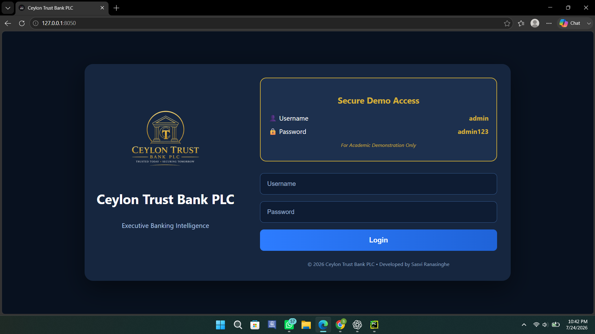
</p>

---

## 🏠 Executive Dashboard

<p align="center">
  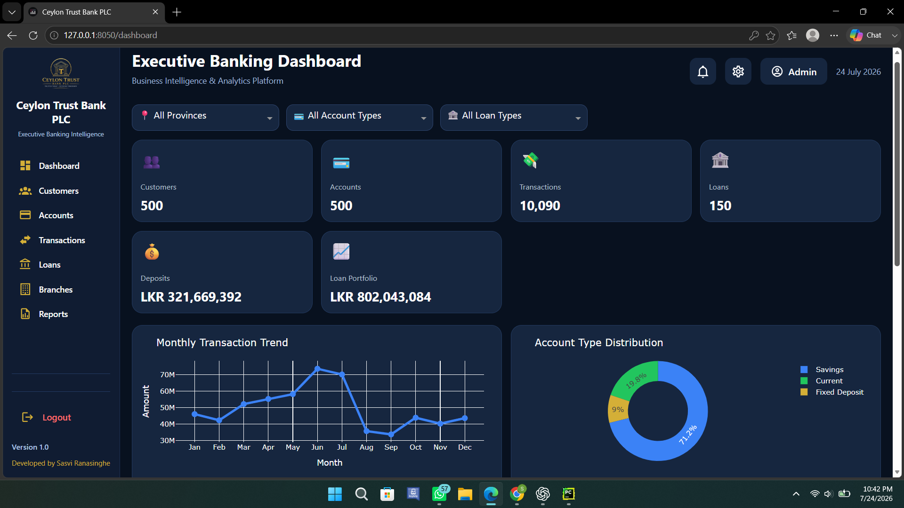
</p>

---

## 👥 Customer Management

<p align="center">
  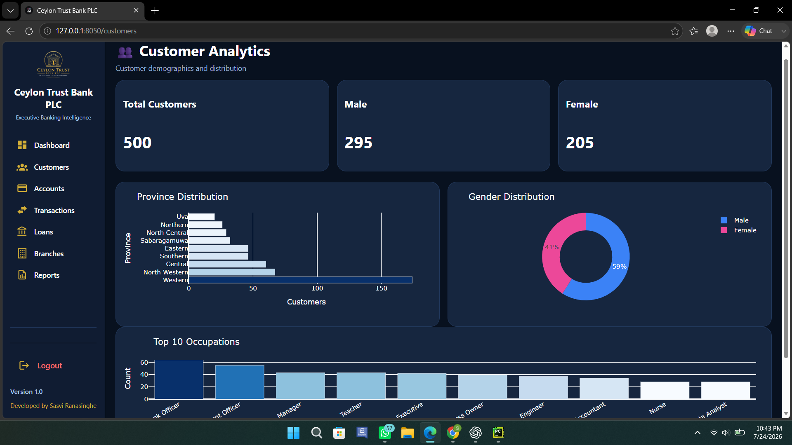
</p>

---

## 💳 Account Management

<p align="center">
  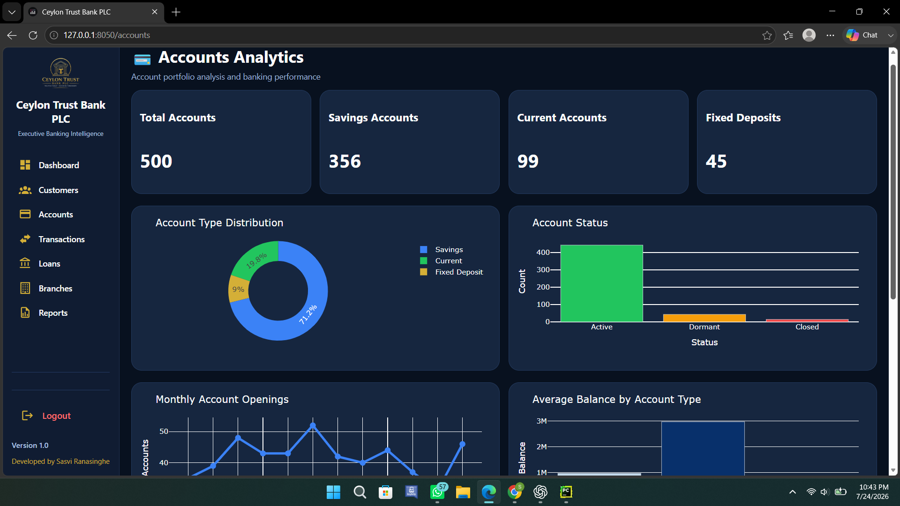
</p>

---

## 💸 Transaction Analytics

<p align="center">
  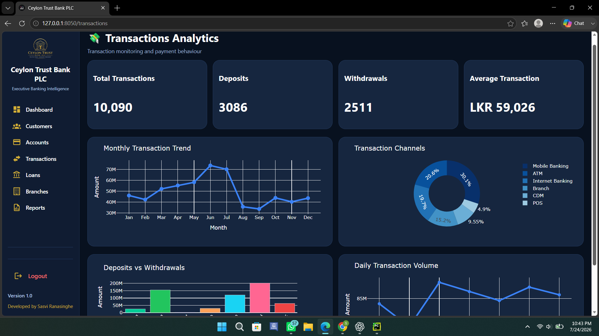
</p>

---

## 🏦 Loan Portfolio

<p align="center">
  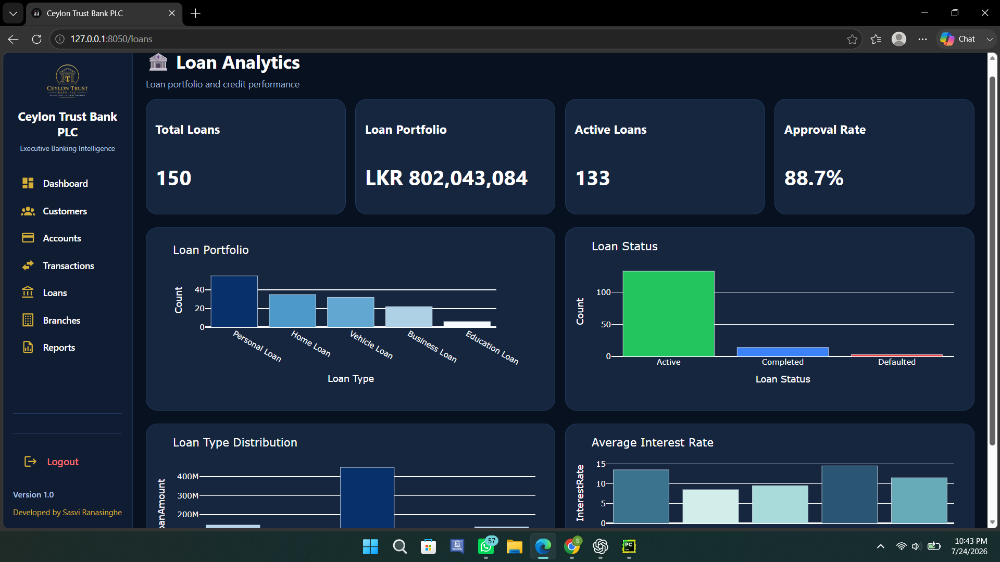
</p>

---

## 🏢 Branch Performance

<p align="center">
  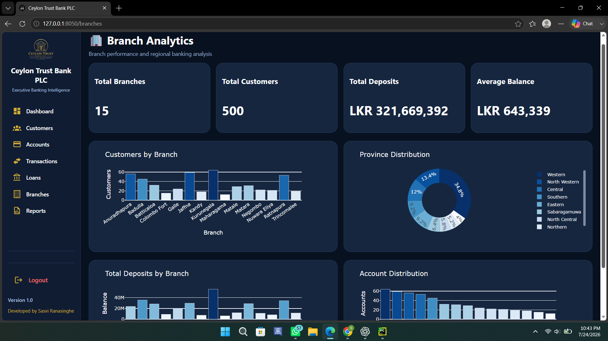
</p>

---

## 📈 Executive Reports

<p align="center">
  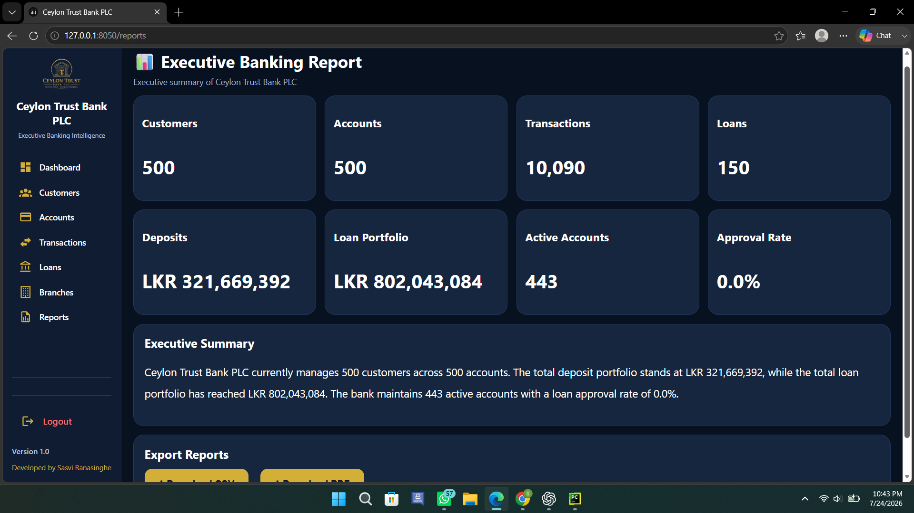
</p>

---

## 👤 User Profile

<p align="center">
  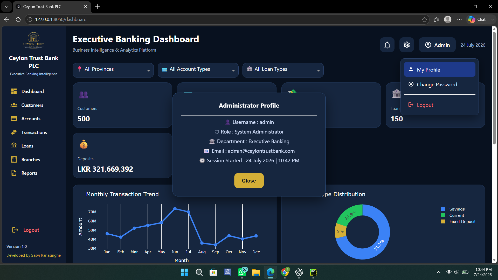
</p>

---

## ⚙️ Settings

<p align="center">
  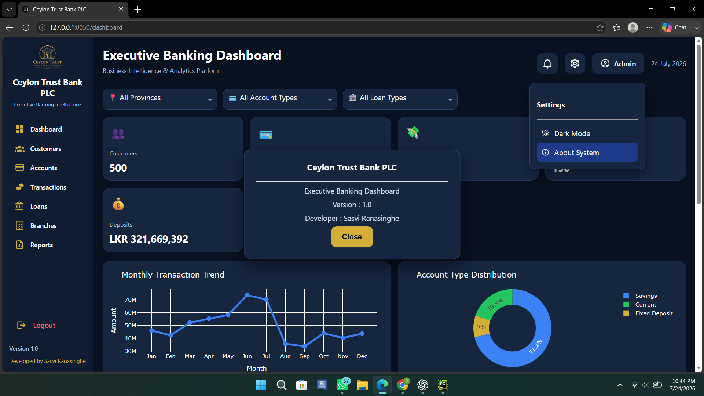
</p>

---

## 🚪 Logout

<p align="center">
  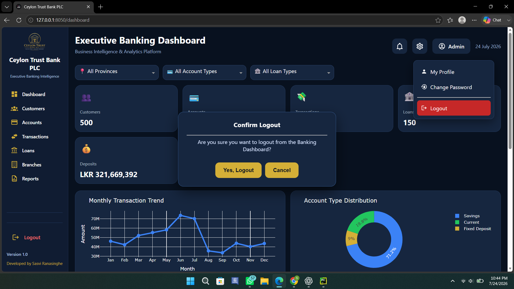
</p>

---

# ⚙️ Installation

## 1. Clone the Repository

```bash
git clone https://github.com/Sasvi-Ranasinghe/Ceylon-Trust-Bank-Dashboard.git
```

## 2. Navigate to the Project

```bash
cd Ceylon-Trust-Bank-Dashboard
```

## 3. Install Dependencies

```bash
pip install -r requirements.txt
```

## 4. Run the Application

```bash
python app.py
```

The dashboard will be available at:

```text
http://127.0.0.1:8050/
```

---

# 📊 Database

The application uses a local **SQLite** database together with banking datasets to power the dashboard. Data is processed using **Pandas** and visualized through **Plotly** within the Dash framework.

---

# 🚀 Future Enhancements

- Role-based user authentication
- Live database connectivity
- Real-time banking analytics
- Export reports to PDF & Excel
- Advanced predictive analytics
- AI-powered business insights
- Cloud deployment support

---

# 👨‍💻 Developer

**Sasvi Ranasinghe**

**Management Information Systems Undergraduate**  
SLIIT Business School

- 🌐 GitHub: https://github.com/Sasvi-Ranasinghe
- 💼 LinkedIn: *https://www.linkedin.com/in/sasvi-ranasinghe/*

---

<div align="center">

### ⭐ If you found this project interesting, consider giving it a star!

**Developed for educational and portfolio purposes.**

© 2026 Sasvi Ranasinghe

</div>
